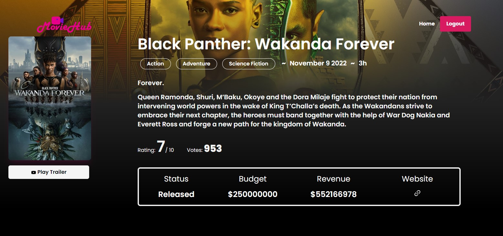
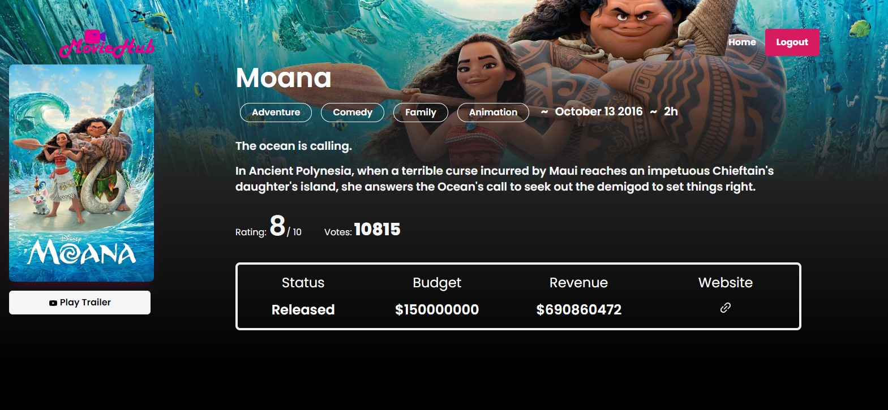
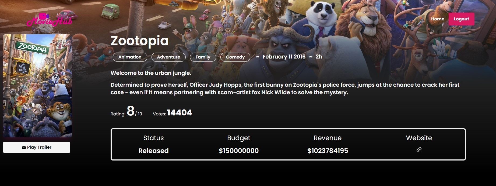
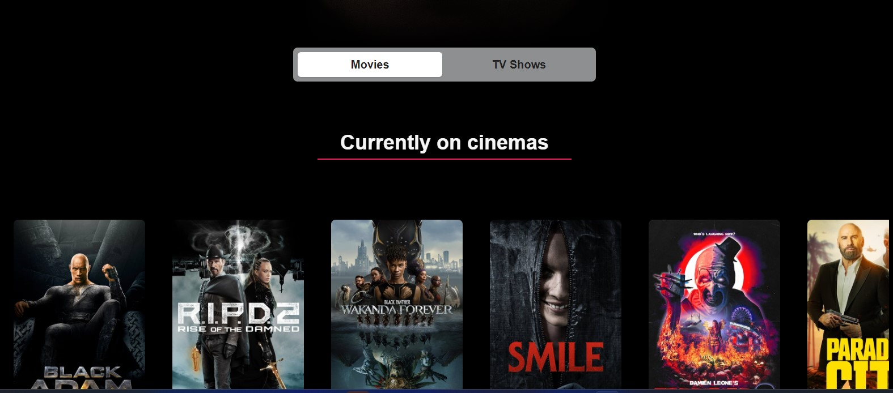

# MovieHub

MovieHub is a web application that contains relevant information about all publicly available Actors, Movies, Series, Animations and TV Shows. Quickly get all relevant information including movie trailers and additional actor details. Have a nice immersive experience exploring the app.

### Issues
 - Still working on search feature which will be available soon.
 - Responsiveness on old Samsung devices is a mess(Galaxy S8+, S9).
 - If you find any new issues aside from the listed issues, create an issue/bug report in this repo.

 ### Technologies used
 - React 18
 - Firebase & Firebase Authentication (Please don't judge me)
 - Tailwind CSS
 - Material Tailwind
 - TMDB Rest API

 ### Screenshots

 
 
 
  
 
 
  

 ### Author
 
 ##### Gamaliel Sirengo
 - <a href='https://t.me/sirgama' >Telegram</a>
  - <a href='https://twitter.com/sirgama_' >Twitter</a>